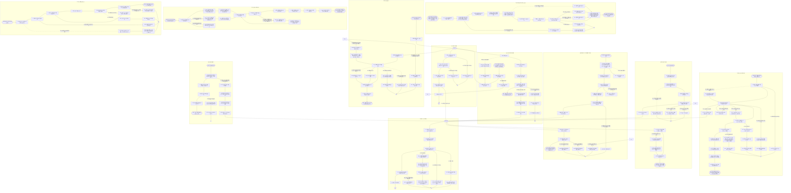

# 주식 투자 에이전트 팀 유저 플로우

> 기준 문서: [기획 PRD](prd.md) · [기획 상세 스펙](spec.md) · [유저 플로우](flow.md)

기획 상세 스펙에서 만든 그림이다. 고칠 때는 기획 상세 스펙을 고친다. 점선은 예외 흐름이다.

```mermaid
flowchart TD
  subgraph F1["F1 하루 운용 시작과 쉬기"]
    F1_start(["시작: 거래일 아침에 팀장이 하루를 시작한다"])
    F1_1["1. 거래일 아침에 팀장이 하루를 시작한다"]
    F1_2["2. 팀장이 지난 상태와 자료와 연결을 확인한다"]
    F1_3["3. 팀장이 시장 상황을 보고 오늘 판단을 정한다"]
    F1_4["4. 투자 팀이 쉬는 중에서 운용 중으로 바뀐다"]
    F1_5["5. 담당들이 각자 방에서 사무실 자기 자리로 출근한다"]
    F1_6["6. 사무실 화면에 오늘 운용을 시작한 이유가 보인다"]
    F1_7["7. 장이 끝나면 투자 팀이 운용 중에서 쉬는 중으로 바뀐다"]
    F1_8["8. 담당들이 각자 방으로 돌아가 침대에서 잔다"]
    F1_done(["성공: 투자 팀이 운용 중으로 하루를 보내고 장이 끝나면 쉬는 중으로 돌아간다"])
    F1_1a1["1a1. 투자 팀은 쉬는 중으로 남는다"]
    F1_2a1["2a1. 투자 팀이 하루 한도 멈춤에서 쉬는 중으로 바뀐다"]
    F1_2b1["2b1. 자료와 연결이 정상인지 다시 확인한다"]
    F1_2c1["2c1. 사무실 화면에 내 확인이 필요하다고 보인다"]
    F1_2d1["2d1. 투자 팀이 쉬는 중에서 이상 감지 멈춤으로 바뀐다"]
    F1_2d2["2d2. 나에게 이상 상황 알림이 간다"]
    F1_3a1["3a1. 사무실 화면에 오늘은 쉬는 이유가 보인다"]
    F1_3a2["3a2. 투자 팀은 쉬는 중으로 남는다"]
    F1_3a3["3a3. 담당들은 각자 방 침대에서 잔다"]
    F1_4a1["4a1. 장 중에 하루 손실 한도에 닿았는가가 예가 되면 투자 팀이 운용 중에서 하루 한도 멈춤으로 바뀐다"]
    F1_4a2["4a2. 그날은 새로 사지 않고 파는 것만 한다"]
    F1_1b1["1b1. 팀이 꺼지기 전 상태와 하던 일을 이어서 한다"]
    F1_stop(("끝"))
  end
    F1_start --> F1_1
    F1_1 --> F1_2
    F1_2 --> F1_3
    F1_3 --> F1_4
    F1_4 --> F1_5
    F1_5 --> F1_6
    F1_6 --> F1_7
    F1_7 --> F1_8
    F1_8 --> F1_done
    F1_1 -->|"1a. 장이 열려 있는가: 아니오"| F1_1a1
    F1_1a1 --> F1_stop
    F1_2 -->|"2a. 투자 팀 상태: 하루 한도 멈춤"| F1_2a1
    F1_2a1 --> F1_3
    F1_2 -->|"2b. 투자 팀 상태: 이상 감지 멈춤"| F1_2b1
    F1_2b1 --> F1_2
    F1_2 -->|"2c. 투자 팀 상태: 전체 정지"| F1_2c1
    F1_2c1 --> FN2_start
    F1_2 -->|"2d. 자료와 연결이 정상인가: 아니오"| F1_2d1
    F1_2d1 --> F1_2d2
    F1_2d2 --> F1_stop
    F1_3 -->|"3a. 오늘 판단: 쉬기"| F1_3a1
    F1_3a1 --> F1_3a2
    F1_3a2 --> F1_3a3
    F1_3a3 --> F1_stop
    F1_4 -->|"4a. 투자 팀 상태: 운용 중"| F1_4a1
    F1_4a1 --> F1_4a2
    F1_4a2 --> F1_stop
    F1_1 -.->|"1b. 컴퓨터가 꺼졌다가 다시 켜진다"| F1_1b1
    F1_1b1 --> F1_2
  subgraph F2["F2 일이 생겨 팀이 논의하고 판단"]
    F2_start(["시작: 뉴스나 공시가 뜨거나 시세가 조건에 닿거나 정해진 시간이 되거나 재무나 거시 자료가 바뀐다"])
    F2_1["1. 뉴스 공시 시세 담당이 계기를 알아차린다"]
    F2_2["2. 담당이 실시간 시세와 거래량과 재무제표와 거시경제 지표와 뉴스 공시를 가져온다"]
    F2_3["3. 담당이 계기와 자료를 관련 담당에게 넘긴다"]
    F2_4["4. 넘겨받은 담당들이 비슷했던 지난 매매와 복기를 꺼내 본다"]
    F2_5["5. 전략 담당은 살지 팔지 의견을 내고 리스크 담당은 한도와 비중 의견을 내며 논의한다"]
    F2_6["6. 담당마다 점수와 근거를 낸다"]
    F2_7["7. 매매가 논의중에서 판단됨으로 바뀐다"]
    F2_8["8. 팀장이 합의 점수를 보고 종목 판단을 정한다"]
    F2_9["9. 가설과 계기와 들어간 값과 손절값과 목표값과 자료를 알게 된 시각이 내 컴퓨터의 매매 기록에 남는다"]
    F2_done(["성공: 팀장의 종목 판단과 담당별 점수와 근거가 매매 기록에 남는다"])
    F2_2a1["2a1. 가져오지 못한 자료와 이유가 남는다"]
    F2_2a2["2a2. 투자 팀이 운용 중에서 이상 감지 멈춤으로 바뀐다"]
    F2_8a1["8a1. 팀장이 지켜보기로 정한다"]
    F2_8b1["8b1. 보유 종목 팔기 흐름으로 넘어간다"]
    F2_8c1["8c1. 지켜보는 이유와 다시 볼 조건이 남는다"]
    F2_5a1["5a1. 팀장이 지켜보기로 정한다"]
    F2_stop(("끝"))
  end
    F2_start --> F2_1
    F2_1 --> F2_2
    F2_2 --> F2_3
    F2_3 --> F2_4
    F2_4 --> F2_5
    F2_5 --> F2_6
    F2_6 --> F2_7
    F2_7 --> F2_8
    F2_8 --> F2_9
    F2_9 --> F2_done
    F2_2 -->|"2a. 자료와 연결이 정상인가: 아니오"| F2_2a1
    F2_2a1 --> F2_2a2
    F2_2a2 --> F2_stop
    F2_8 -->|"8a. 합의 점수가 기준을 넘는가: 아니오"| F2_8a1
    F2_8a1 --> F2_9
    F2_8 -->|"8b. 종목 판단: 팔기"| F2_8b1
    F2_8b1 --> F2_stop
    F2_8 -->|"8c. 종목 판단: 지켜보기"| F2_8c1
    F2_8c1 --> F2_9
    F2_5 -.->|"5a. 담당 하나가 답하지 못한다"| F2_5a1
    F2_5a1 --> F2_9
  subgraph F3["F3 사기 주문 내기"]
    F3_start(["시작: 팀장의 종목 판단이 사기로 정해진다"])
    F3_1["1. 매매 담당이 주문 안을 만든다"]
    F3_3["3. 매매가 판단됨에서 주문됨으로 바뀐다"]
    F3_4["4. 모의계좌에서 주문이 체결된다"]
    F3_5["5. 매매가 주문됨에서 보유중으로 바뀐다"]
    F3_6["6. 사무실과 폰에 산 이유가 쉬운 말로 보인다"]
    F3_done(["성공: 종목을 보유하고 산 이유가 쉬운 말로 보인다"])
    F3_2a1["2a1. 매매가 판단됨에서 막힘으로 바뀐다"]
    F3_2a2["2a2. 사무실과 폰에 막힌 이유가 보인다"]
    F3_2b1["2b1. 매매가 판단됨에서 승인대기로 바뀐다"]
    F3_2b2["2b2. 승인되거나 한도 안으로 줄여지면 매매가 승인대기에서 주문됨으로 바뀐다"]
    F3_4a1["4a1. 증권사 계좌로 주문이 나간다"]
    F3_4b1["4b1. 체결되지 않은 부분을 취소한다"]
    F3_4c1["4c1. 주문을 취소하고 체결되지 않은 이유가 남는다"]
    F3_4d1["4d1. 투자 팀이 운용 중에서 이상 감지 멈춤으로 바뀐다"]
    F3_4d2["4d2. 나에게 이상 상황 알림이 간다"]
    F3_stop(("끝"))
  end
    F3_start --> F3_1
    F3_1 --> FN1_start
    FN1_start --> F3_3
    F3_3 --> F3_4
    F3_4 --> F3_5
    F3_5 --> F3_6
    F3_6 --> F3_done
    F3_2 -->|"2a. 점검에서 근거나 원칙에 걸려 주문이 막힌다"| F3_2a1
    F3_2a1 --> F3_2a2
    F3_2a2 --> F3_stop
    F3_2 -->|"2b. 점검에서 금액 한도를 넘어 내 승인을 기다린다"| F3_2b1
    F3_2b1 --> F3_2b2
    F3_2b2 --> F3_4
    F3_4 -->|"4a. 계좌 종류: 실전"| F3_4a1
    F3_4a1 --> F3_5
    F3_4 -.->|"4b. 정한 시간 안에 일부만 체결된다"| F3_4b1
    F3_4b1 --> F3_5
    F3_4 -.->|"4c. 정한 시간 안에 하나도 체결되지 않는다"| F3_4c1
    F3_4c1 --> F3_stop
    F3_4 -.->|"4d. 증권사 주문이 실패한다"| F3_4d1
    F3_4d1 --> F3_4d2
    F3_4d2 --> F3_stop
  subgraph F4["F4 보유 종목 팔기와 멈춤"]
    F4_start(["시작: 손절값이나 목표값에 닿거나 팀장이 팔기로 정하거나 최대 보유 기간이 지난다"])
    F4_1["1. 매매 담당이 파는 계기를 알아차린다"]
    F4_2["2. 매매 담당이 파는 주문 안을 만든다"]
    F4_4["4. 주문이 체결된다"]
    F4_5["5. 매매가 보유중에서 팔림으로 바뀐다"]
    F4_6["6. 사무실과 폰에 판 이유와 손익이 쉬운 말로 보인다"]
    F4_7["7. 자동 규칙이 그날 손실과 계좌 최고점 대비 손실을 다시 계산한다"]
    F4_done(["성공: 종목을 팔고 판 이유와 손익이 쉬운 말로 보인다"])
    F4_1a1["1a1. 논의 없이 바로 파는 주문 안을 만든다"]
    F4_7a1["7a1. 투자 팀이 운용 중에서 하루 한도 멈춤으로 바뀐다"]
    F4_7a2["7a2. 그날은 새로 사지 않고 파는 것만 한다"]
    F4_7a3["7a3. 나에게 멈춤 알림이 간다"]
    F4_7b1["7b1. 투자 팀이 운용 중에서 전체 정지로 바뀐다"]
    F4_7b2["7b2. 새 매매를 모두 멈추고 걸어 둔 손절값에 닿을 때만 판다"]
    F4_7b3["7b3. 나에게 큰 손실 알림이 간다"]
    F4_4a1["4a1. 투자 팀이 운용 중에서 이상 감지 멈춤으로 바뀐다"]
    F4_4a2["4a2. 나에게 이상 상황 알림이 간다"]
    F4_stop(("끝"))
  end
    F4_start --> F4_1
    F4_1 --> F4_2
    F4_2 --> FN1_start
    FN1_start --> F4_4
    F4_4 --> F4_5
    F4_5 --> F4_6
    F4_6 --> F4_7
    F4_7 --> F4_done
    F4_1 -->|"1a. 손절값에 닿았다"| F4_1a1
    F4_1a1 --> F4_3
    F4_7 -->|"7a. 하루 손실 한도에 닿았는가: 예"| F4_7a1
    F4_7a1 --> F4_7a2
    F4_7a2 --> F4_7a3
    F4_7a3 --> F4_stop
    F4_7 -->|"7b. 최대 손실에 닿았는가: 예"| F4_7b1
    F4_7b1 --> F4_7b2
    F4_7b2 --> F4_7b3
    F4_7b3 --> FN2_start
    F4_4 -.->|"4a. 파는 주문이 실패한다"| F4_4a1
    F4_4a1 --> F4_4a2
    F4_4a2 --> F4_2
  subgraph F5["F5 복기와 규칙 개선"]
    F5_start(["시작: 그날 장이 끝난다"])
    F5_1["1. 장이 끝나면 복기 담당이 그날 팔린 매매를 모은다"]
    F5_2["2. 복기 담당이 매매마다 근거와 결과를 비교해 실수를 기록한다"]
    F5_3["3. 매매가 팔림에서 복기됨으로 바뀐다"]
    F5_4["4. 복기 담당이 같은 실수가 2번 쌓였는지 확인한다"]
    F5_5["5. 복기 담당이 규칙 개선안을 낸다"]
    F5_7["7. 규칙 개선안이 제안됨에서 반영됨으로 바뀐다"]
    F5_8["8. 사무실과 폰에 바뀐 규칙이 보인다"]
    F5_done(["성공: 바뀐 규칙이 다음 매매부터 적용되고 사무실과 폰에 보인다"])
    F5_4a1["4a1. 실수 기록만 남는다"]
    F5_6a1["6a1. 규칙 개선안이 제안됨에서 거절됨으로 바뀐다"]
    F5_7a1["7a1. 규칙 개선안이 제안됨에서 냉각중으로 바뀐다"]
    F5_7a2["7a2. 다음 거래일에 규칙 개선안이 냉각중에서 반영됨으로 바뀐다"]
    F5_2a1["2a1. 못 끝낸 매매는 다음 장 마감 뒤 복기에 넘겨진다"]
    F5_stop(("끝"))
  end
    F5_start --> F5_1
    F5_1 --> F5_2
    F5_2 --> F5_3
    F5_3 --> F5_4
    F5_4 --> F5_5
    F5_5 --> FN2_start
    FN2_start --> F5_7
    F5_7 --> F5_8
    F5_8 --> F5_done
    F5_4 -->|"4a. 같은 실수가 아직 2번 쌓이지 않았다"| F5_4a1
    F5_4a1 --> F5_stop
    F5_6 -->|"6a. 사용자가 개선안을 거절한다"| F5_6a1
    F5_6a1 --> F5_stop
    F5_7 -->|"7a. 개선안이 위험을 키우는가: 예"| F5_7a1
    F5_7a1 --> F5_7a2
    F5_7a2 --> F5_8
    F5_2 -.->|"2a. 복기 담당이 복기를 끝내지 못한다"| F5_2a1
    F5_2a1 --> F5_stop
  subgraph F6["F6 템플릿 고르고 모의에서 실전으로"]
    F6_start(["시작: 사용자가 처음 설정을 연다"])
    F6_1["1. 사용자가 처음 설정에서 AI 키와 증권사 키를 등록하고 넣은 키는 다시 볼 수 없게 가려진다"]
    F6_2["2. 사용자가 단타와 스윙과 중장기 중 템플릿을 고른다"]
    F6_3["3. 사용자가 템플릿 값을 원칙 상한 안에서 맞춘다"]
    F6_4["4. 템플릿이 모의계좌에서 돌기 시작하고 모의중이 된다"]
    F6_5["5. 자동 규칙이 템플릿마다 정한 승격 기준과 모의 결과를 비교한다"]
    F6_6["6. 템플릿이 모의중에서 승격대기로 바뀐다"]
    F6_8["8. 템플릿이 승격대기에서 실전중으로 바뀐다"]
    F6_9["9. 사무실과 폰에 실전 운용 시작이 보인다"]
    F6_done(["성공: 템플릿이 실전 계좌에서 돌고 사무실과 폰에 실전 시작이 보인다"])
    F6_3a1["3a1. 그 값은 저장되지 않고 상한이 보인다"]
    F6_5a1["5a1. 모자란 기준이 보인다"]
    F6_7a1["7a1. 템플릿이 승격대기에서 모의중으로 바뀐다"]
    F6_9a1["9a1. 템플릿이 실전중에서 멈춤으로 바뀐다"]
    F6_9b1["9b1. 템플릿이 실전중에서 멈춤으로 바뀐다"]
    F6_1a1["1a1. 키가 맞지 않다는 안내가 보인다"]
    F6_stop(("끝"))
  end
    F6_start --> F6_1
    F6_1 --> F6_2
    F6_2 --> F6_3
    F6_3 --> F6_4
    F6_4 --> F6_5
    F6_5 --> F6_6
    F6_6 --> FN2_start
    FN2_start --> F6_8
    F6_8 --> F6_9
    F6_9 --> F6_done
    F6_3 -->|"3a. 사용자가 원칙 상한을 넘는 값을 넣는다"| F6_3a1
    F6_3a1 --> F6_3
    F6_5 -->|"5a. 템플릿이 기준을 통과했는가: 아니오"| F6_5a1
    F6_5a1 --> F6_stop
    F6_7 -->|"7a. 사용자가 실전 승격을 거절한다"| F6_7a1
    F6_7a1 --> F6_stop
    F6_9 -->|"9a. 사용자가 실전 템플릿을 멈춘다"| F6_9a1
    F6_9a1 --> F6_stop
    F6_9 -->|"9b. 투자 팀이 전체 정지가 된다"| F6_9b1
    F6_9b1 --> F6_stop
    F6_1 -.->|"1a. 키 등록이 실패한다"| F6_1a1
    F6_1a1 --> F6_1
  subgraph F7["F7 사무실과 폰에서 보기"]
    F7_start(["시작: 사용자가 컴퓨터나 폰에서 가격인하를 연다"])
    F7_1["1. 사용자가 컴퓨터에서 가격인하를 연다"]
    F7_2["2. 3D 사무실에서 담당들이 자기 자리에서 일하고 모여 논의하는 모습이 보인다"]
    F7_3["3. 일하지 않는 시간에는 담당들이 각자 방 침대에서 자는 모습이 보인다"]
    F7_4["4. 사무실 채팅에 팀의 대화가 보인다"]
    F7_5["5. 사용자가 담당에게 왜 샀는지 묻는다"]
    F7_6["6. 담당이 매매 근거를 쉬운 말로 답한다"]
    F7_7["7. 사용자가 매매를 눌러 근거 요약을 읽는다"]
    F7_8["8. 퇴근 후 사용자가 하루 정리를 연다"]
    F7_9["9. 오늘 한 일과 손익과 복기가 한 화면에 보인다"]
    F7_done(["성공: 팀의 대화와 매매 근거와 하루 정리를 보고 담당과 이야기를 나눈다"])
    F7_1a1["1a1. 승인 요청과 알림과 채팅과 하루 정리 중심의 가벼운 화면이 보인다"]
    F7_1a2["1a2. 사용자가 3D 사무실을 누르면 사무실 화면이 열린다"]
    F7_5a1["5a1. 지시가 팀장에게 넘어가 논의의 계기가 된다"]
    F7_5a2["5a2. 팀의 논의와 판단은 일이 생겨 팀이 논의하고 판단하는 흐름을 따른다"]
    F7_1b1["1b1. 연결이 끊겼다는 안내와 마지막으로 받은 상태가 보인다"]
  end
    F7_start --> F7_1
    F7_1 --> F7_2
    F7_2 --> F7_3
    F7_3 --> F7_4
    F7_4 --> F7_5
    F7_5 --> F7_6
    F7_6 --> F7_7
    F7_7 --> F7_8
    F7_8 --> F7_9
    F7_9 --> F7_done
    F7_1 -->|"1a. 사용자가 폰에서 가격인하를 연다"| F7_1a1
    F7_1a1 --> F7_1a2
    F7_1a2 --> F7_4
    F7_5 -->|"5a. 사용자가 담당에게 오늘은 쉬자거나 이 종목을 봐 달라고 지시한다"| F7_5a1
    F7_5a1 --> F7_5a2
    F7_5a2 --> F7_4
    F7_1 -.->|"1b. 집 컴퓨터에 연결되지 않는다"| F7_1b1
    F7_1b1 --> F7_1
  subgraph FN1["FN1 주문 전 점검"]
    FN1_start(["FN1 시작"])
    FN1_1["1. 자동 규칙이 근거가 다 있는지 확인한다"]
    FN1_2["2. 자동 규칙이 기본 원칙 16개와 주문 직전 점검을 확인한다"]
    FN1_3["3. 자동 규칙이 수량과 가격을 계산한다"]
    FN1_4["4. 자동 규칙이 주문 금액을 금액 한도와 비교한다"]
    FN1_5["5. 점검을 통과한다"]
    FN1_done(["끝"])
    FN1_1a1["1a1. 주문이 막히고 빠진 근거가 남는다"]
    FN1_2a1["2a1. 주문이 막히고 어긴 원칙이 남는다"]
    FN1_stop(("끝"))
  end
    FN1_start --> FN1_1
    FN1_1 --> FN1_2
    FN1_2 --> FN1_3
    FN1_3 --> FN1_4
    FN1_4 --> FN1_5
    FN1_5 --> FN1_done
    FN1_1 -->|"1a. 근거가 다 있는가: 아니오"| FN1_1a1
    FN1_1a1 --> FN1_stop
    FN1_2 -->|"2a. 원칙을 지키는가: 아니오"| FN1_2a1
    FN1_2a1 --> FN1_stop
    FN1_4 -->|"4a. 금액 한도 안인가: 넘음"| FN2_start
  subgraph FN2["FN2 내 승인 기다리기"]
    FN2_start(["FN2 시작"])
    FN2_1["1. 나에게 폰과 사무실로 승인 요청 알림이 간다"]
    FN2_2["2. 알림에 무엇을 왜 묻는지 쉬운 말로 보인다"]
    FN2_3["3. 사용자가 승인을 누르고 인증 앱 6자리를 넣는다"]
    FN2_4["4. 승인한 내용과 실행할 내용이 같은지 확인된다"]
    FN2_5["5. 요청한 일이 진행된다"]
    FN2_done(["끝"])
    FN2_3a1["3a1. 거절은 6자리 없이 바로 된다"]
    FN2_3a2["3a2. 요청한 일을 하지 않고 거절했다는 기록이 남는다"]
    FN2_3c1["3c1. 승인 확인 실패는 거절로 남고 팀이 대신 판단하지 않는다"]
    FN2_3b1["3b1. 신호마다 템플릿에서 정한 시간을 기다린다"]
    FN2_3b2["3b2. 주문이면 팀이 위험 신호인지 익절 신호인지 보고 스스로 판단한다"]
    FN2_3b3["3b3. 사는 주문은 금액 한도 안으로 줄여서 낸다"]
    FN2_3b4["3b4. 다시 시작과 규칙 개선과 실전 승격은 내 답이 올 때까지 기다린다"]
    FN2_4a1["4a1. 그 일은 진행되지 않고 거절로 남는다"]
    FN2_stop(("끝"))
  end
    FN2_start --> FN2_1
    FN2_1 --> FN2_2
    FN2_2 --> FN2_3
    FN2_3 --> FN2_4
    FN2_4 --> FN2_5
    FN2_5 --> FN2_done
    FN2_3 -->|"3a. 내 답: 거절"| FN2_3a1
    FN2_3a1 --> FN2_3a2
    FN2_3a2 --> FN2_stop
    FN2_3 -->|"3c. 6자리가 맞는가: 아니오"| FN2_3c1
    FN2_3c1 --> FN2_stop
    FN2_3 -->|"3b. 내 답: 답 없음"| FN2_3b1
    FN2_3b1 --> FN2_3b2
    FN2_3b2 --> FN2_3b3
    FN2_3b3 --> FN2_3b4
    FN2_3b4 --> FN2_stop
    FN2_4 -.->|"4a. 승인한 뒤 실행할 내용이 바뀌었다"| FN2_4a1
    FN2_4a1 --> FN2_stop
  subgraph F8["F8 내 기기에서 들어오기"]
    F8_start(["시작: 사용자가 가격인하 주소를 연다"])
    F8_1["1. 사용자가 내 기기에서 가격인하 주소를 연다"]
    F8_2["2. 등록된 내 기기임이 확인된다"]
    F8_3["3. 인증 앱 6자리를 묻는 화면이 보인다"]
    F8_4["4. 사용자가 6자리를 넣는다"]
    F8_5["5. 6자리가 확인되고 가격인하에 들어온다"]
    F8_6["6. 언제 어디서 들어왔는지 접속 기록이 남는다"]
    F8_done(["성공: 가격인하에 들어오고 접속 기록이 남는다"])
    F8_2a1["2a1. 주소에 닿지 않아 아무 응답이 없다"]
    F8_5a1["5a1. 이미 쓴 코드나 틀린 코드라는 안내가 보인다"]
    F8_6a1["6a1. 등록한 기기와 언제 어디서 무엇을 했는지가 보인다"]
    F8_5b1["5b1. 한동안 더 시도할 수 없다"]
    F8_5b2["5b2. 나에게 로그인 실패 알림이 간다"]
    F8_1a1["1a1. 사용자가 다른 등록 기기에서 그 폰의 접속을 끊는다"]
    F8_1a2["1a2. 사용자가 팀이 도는 집 컴퓨터 앞에서 인증 앱을 새로 등록한다"]
    F8_stop(("끝"))
  end
    F8_start --> F8_1
    F8_1 --> F8_2
    F8_2 --> F8_3
    F8_3 --> F8_4
    F8_4 --> F8_5
    F8_5 --> F8_6
    F8_6 --> F8_done
    F8_2 -->|"2a. 등록된 내 기기인가: 아니오"| F8_2a1
    F8_2a1 --> F8_stop
    F8_5 -->|"5a. 6자리가 맞는가: 아니오"| F8_5a1
    F8_5a1 --> F8_3
    F8_6 -->|"6a. 사용자가 등록 기기와 접속 기록을 연다"| F8_6a1
    F8_6a1 --> F8_stop
    F8_5 -.->|"5b. 여러 번 틀린다"| F8_5b1
    F8_5b1 --> F8_5b2
    F8_5b2 --> F8_stop
    F8_1 -.->|"1a. 인증 앱이 든 폰을 잃어버렸다"| F8_1a1
    F8_1a1 --> F8_1a2
    F8_1a2 --> F8_stop
  subgraph F9["F9 백업과 되살리기"]
    F9_start(["시작: 그날 장이 끝난다"])
    F9_1["1. 장이 끝나면 팀의 상태와 템플릿과 지식을 한 시점으로 모은다"]
    F9_2["2. 비밀키와 인증 앱 비밀값은 빼고 암호화한다"]
    F9_3["3. 내 비공개 GitHub에 올린다"]
    F9_4["4. 하루 정리에 백업이 끝났다고 보인다"]
    F9_done(["성공: 하루 정리에 백업이 끝났다고 보인다"])
    F9_1a1["1a1. 투자 팀은 멈춘 상태로 시작한다"]
    F9_1a2["1a2. 백업 때 기다리던 승인은 모두 만료되어 실행되지 않는다"]
    F9_1a3["1a3. 사용자가 증권사 키와 AI 키와 인증 앱을 다시 등록한다"]
    F9_1a4["1a4. 사용자가 다시 시작을 눌러야 팀이 돈다"]
    F9_3a1["3a1. 하루 정리에 백업 실패가 보이고 나에게 알림이 간다"]
    F9_3a2["3a2. 다음 장 마감 뒤에 다시 올린다"]
    F9_stop(("끝"))
  end
    F9_start --> F9_1
    F9_1 --> F9_2
    F9_2 --> F9_3
    F9_3 --> F9_4
    F9_4 --> F9_done
    F9_1 -->|"1a. 사용자가 새 컴퓨터에서 백업을 되살린다"| F9_1a1
    F9_1a1 --> F9_1a2
    F9_1a2 --> F9_1a3
    F9_1a3 --> F9_1a4
    F9_1a4 --> FN2_start
    F9_3 -.->|"3a. 백업을 올리지 못한다"| F9_3a1
    F9_3a1 --> F9_3a2
    F9_3a2 --> F9_stop
```
